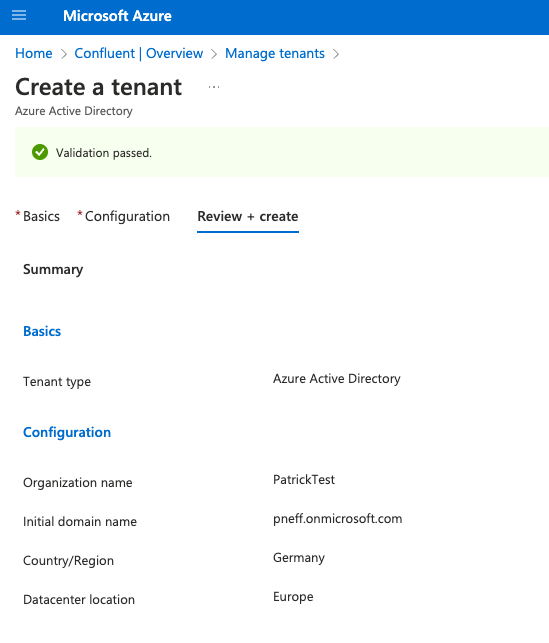

# Client OAuth with Azure AD


## Prerequisites

* Confluent Platform: 7.2.1 or later; 7.1.3 or later
* Dedicated Confluent Cloud cluster

## Azure

### Create Azure Active Directory (AD)



### Create Application

On the left bar under App registrations, create a new one with the default configurations.

In the folowing, we will often need:
* tenant id -> see applications overview
* token endpoint -> see OAuth 2.0 token endpoint (v1) under endpoints under applications overview
* client id -> see client id under applications overview
* secret id -> see **secret value** under Certificates & secrets on the left bar


### Create Secrets

In the application on the left bar under Certificates & secrets, create
new client secrets. Copy the client secret value.

### Verify Token

Execute:

```shell
curl -X POST -H "Content-Type: application/x-www-form-urlencoded" \
-d 'client_id=[client_id]&scope=api://[client_id]/.default&client_secret=[client_secret value]&grant_type=client_credentials' \
https://login.microsoftonline.com/[tenant_id]/oauth2/token
```


Decode the responded `access_token` because we need the `iss` later on.

## Confluent Cloud

### Create Identity Provider

Under accounts & access, create an identity provider using the tenant id from the Azure AD application overview.

* Set the `Issuer URI` to the `iss` from the decoded JWT token.
* Set the `JWKS URI` to `https://login.microsoftonline.com/organizations/discovery/v2.0/keys`

**Do not let them filled out automatically!**

More information can be found in the [documentation](https://docs.confluent.io/cloud/current/access-management/authenticate/oauth/identity-providers.html#next-steps).

### Create Identity Pool

We use as a filter `has(claims.iss)` which equals basically to no filter.
We also give them the DeveloperWrite role and DeveloperRead role for all topics and consumer groups.

More information can be found in the [documentation](https://docs.confluent.io/cloud/current/access-management/authenticate/oauth/identity-pools.html#use-identity-pools-with-your-oauth-provider).


## Configure Clients

We create a properties file based on the [documentation](https://docs.confluent.io/cloud/current/access-management/authenticate/oauth/configure-clients-oauth.html):
```properties
bootstrap.servers=<bootstrap-servers>
security.protocol=SASL_SSL
sasl.oauthbearer.token.endpoint.url=https://login.microsoftonline.com/<tenant id>/oauth2/token
sasl.login.callback.handler.class=org.apache.kafka.common.security.oauthbearer.secured.OAuthBearerLoginCallbackHandler
sasl.mechanism=OAUTHBEARER
sasl.jaas.config= \
  org.apache.kafka.common.security.oauthbearer.OAuthBearerLoginModule required \
    clientId='<client id>' \
    scope='patrickOAuth' \
    clientSecret='<client secret value>' \
    extension_logicalCluster='<cluster id>' \
    extension_identityPoolId='<identity pool id>';
```

## Produce and Consume data

Ensure that you have a dedicated Confluent Cloud cluster and the topic you want to
produce and consume.

### Produce

```shell
kafka-console-producer --bootstrap-server <bootstrap-servers> --producer.config client.properties --topic patrickOAuth
```
### Consume

```shell
kafka-console-consumer --bootstrap-server <bootstrap-servers> --consumer.config client.properties --topic patrickOAuth --from-beginning
```

