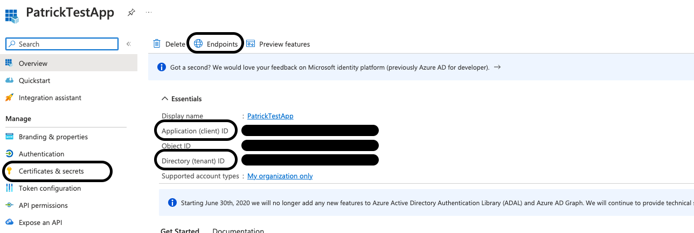
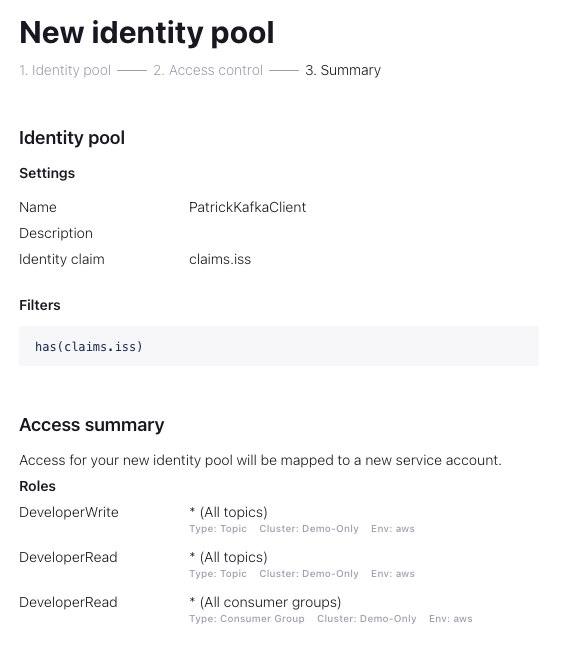

# Client OAuth with Azure AD

This repository provides a ste-by-step walkthrough how to set up client authentication to Confluent Cloud
using OAuth/OIDC.

Recommended Resources
* [OAuth for Confluent Cloud Documentation](https://docs.confluent.io/cloud/current/access-management/authenticate/oauth/overview.html)
* [Getting Started with OAuth for Confluent Cloud Using Azure AD DS Article](https://www.confluent.io/en-gb/blog/configuring-azure-ad-ds-with-oauth-for-confluent/)

Prerequisites

* Confluent Platform: 7.2.1 or later; 7.1.3 or later
* Dedicated Confluent Cloud cluster

## Entra ID (Azure AD)

### Create Application

In Azure AD, on the left bar under App registrations, create a new one with the default configurations.
In the following, we will need:
```
tenant id -> see applications overview
token endpoint -> see OAuth 2.0 token endpoint (v1) under endpoints under applications overview
client id -> see client id under applications overview
secret id -> see secret value under Certificates & secrets on the left bar
```




### Create Secrets

In the application on the left bar under Certificates & secrets, create
new client secrets. Copy the client's secret value.

### Verify Token

Execute:

```shell
curl -X POST -H "Content-Type: application/x-www-form-urlencoded" \
-d 'client_id=[client_id]&scope=api://[client_id]/.default&client_secret=[client_secret value]&grant_type=client_credentials' \
https://login.microsoftonline.com/[tenant_id]/oauth2/token
```

Decode the responded `access_token` because we need the `iss` later on.

## Confluent Cloud

### Create Identity Provider

* [Add an OAuth/OIDC Identity Provider on Confluent Cloud](https://docs.confluent.io/cloud/current/access-management/authenticate/oauth/identity-providers.html)

Under accounts & access, create an identity provider using the tenant id from the Azure AD application overview.

* Set the `Issuer URI` to the `iss` from the decoded JWT token.
* Set the `JWKS URI` to `https://login.microsoftonline.com/organizations/discovery/v2.0/keys`

> [!NOTE]
> Do not let them filled out automatically!


### Create Identity Pool

* [Use Identity Pools with Your OAuth/OIDC Identity Provider on Confluent Cloud](https://docs.confluent.io/cloud/current/access-management/authenticate/oauth/identity-pools.html#use-identity-pools-with-your-oauth-provider)

We use as a filter `has(claims.iss)` which equals basically to no filter.
We also give them the DeveloperWrite role and DeveloperRead role for all topics and consumer groups.





## Configure Clients

* [Configure Clients for OAuth-OIDC on Confluent Cloud](https://docs.confluent.io/cloud/current/access-management/authenticate/oauth/configure-clients-oauth.html)

We create the following properties file:
```properties
bootstrap.servers=<bootstrap-servers>
security.protocol=SASL_SSL
sasl.oauthbearer.token.endpoint.url=https://login.microsoftonline.com/<tenant id>/oauth2/token
sasl.login.callback.handler.class=org.apache.kafka.common.security.oauthbearer.secured.OAuthBearerLoginCallbackHandler
sasl.mechanism=OAUTHBEARER
sasl.jaas.config= \
  org.apache.kafka.common.security.oauthbearer.OAuthBearerLoginModule required \
    clientId='<client id>' \
    scope='patrickOAuth' \
    clientSecret='<client secret value>' \
    extension_logicalCluster='<cluster id>' \
    extension_identityPoolId='<identity pool id>';
```

## Produce and Consume data

Ensure that you have a dedicated Confluent Cloud cluster and the topic you want to
produce and consume.

### Produce

```shell
kafka-console-producer --bootstrap-server <bootstrap-servers> --producer.config client.properties --topic patrickOAuth
```
### Consume

```shell
kafka-console-consumer --bootstrap-server <bootstrap-servers> --consumer.config client.properties --topic patrickOAuth --from-beginning
```

# Why use OAuth instead of API Keys?

Consider you have line of business with 20 applications. 
Using API Keys, you need to create several Service Accounts with role bindings as well as 20 API Keys.
It does not scale very well in terms of CC resources when developing new applications or entire projects, especially for large companies that might become a problem.

When using OAuth, you can create all applications also in Azure AD and assign them to an Azure AD group or a custom role like "LOB A".
Configure your token so that it contains the group or role information.
In CC, only one identity pool with corresponding role bindings can represent the entire project. Ensure using the group/role information from the JWT token as the filter and the app id (Azure AD client id) as the claim (for auditing).
One thing to consider is to have a good topic and application naming strategy, such as `LOB-A-<service-name>-<version>`, so that you can define the role bindings for the identity pool based on that prefix.

Overall instead of creating several resources (SA, API Keys), you only have one (identity pool) for the entire project. Also, you decoupled the project structure out of CC into your own identity provider. 
